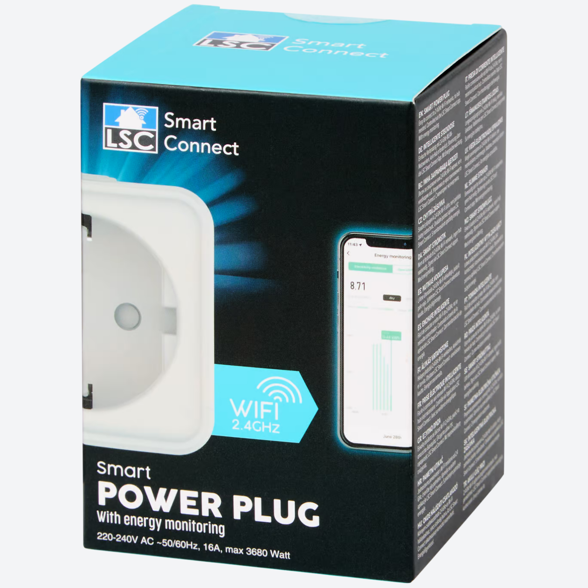
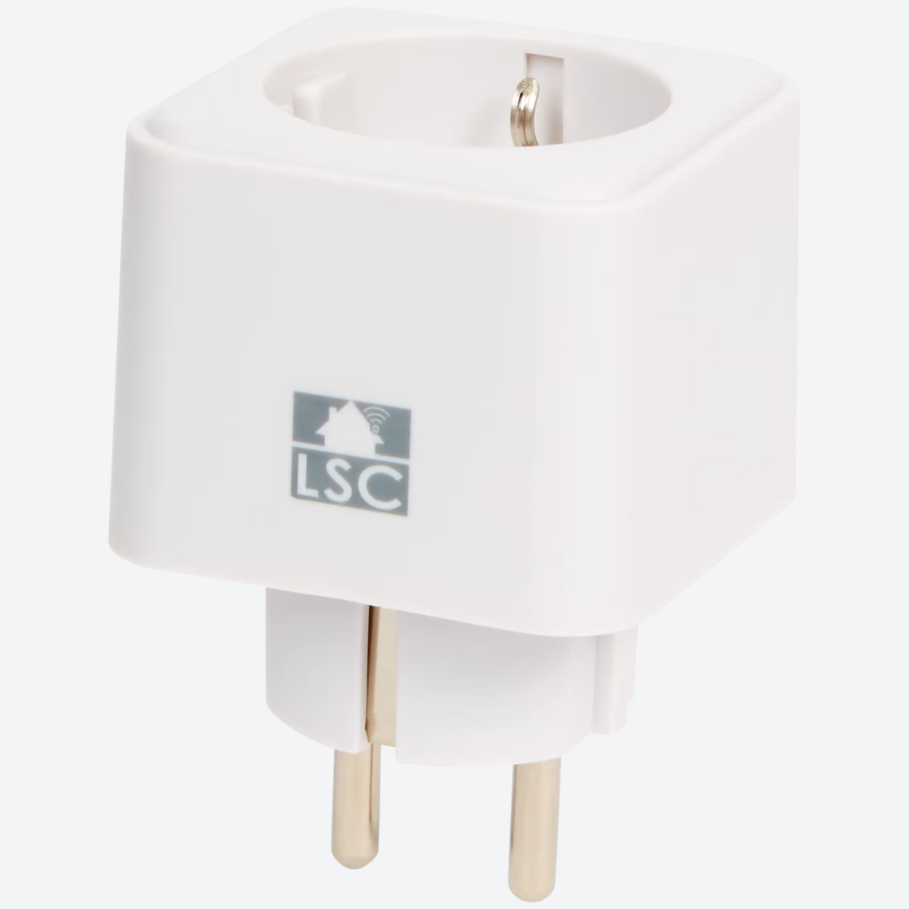

## Notice

- This smart plug with energy monitoring.

## Product Images




## Getting it up and running
I followed this [guide](https://keetsupport.nl/2024/03/20/how-to-flash-lsc-power-plug-with-esphome) with one important note - soldering isn't required if you have oscilloscope test probe clips.

## GPIO Pinout

| Pin | Function        |
| --- | --------------- |
| P26 | cf_pin hlw8012  |
| P24 | cf1_pin hlw8012 |
| P11 | sel_pin hlw8012 |
| P7  | Button          |
| P8  | Relay           |
| P6  | Red LED         |
| P10 | Blue LED        |


## Basic configuration

```yml
esphome:
  name: sockact
  friendly_name: ${friendly_name}
  
bk72xx:
  board: generic-bk7231n-qfn32-tuya

logger:
  baud_rate: 0

web_server:

captive_portal:

substitutions:
  friendly_name: LSC Powerplug 1
  voltage_divider: '795'
  current_resistor: '0.001'
  current_multiply: '0.450' 

mdns:

api:
  encryption:
    key: !secret api_encryption_key

ota:
  platform: esphome
  id: my_ota
  password: !secret ota_password

wifi:
  networks:
    - ssid: !secret wifi_ssid
      password: !secret wifi_password
  ap:

button:
  - platform: restart
    name: Restart

debug:
  update_interval: 30s

text_sensor:
  - platform: debug
    reset_reason:
      name: Reset Reason
  - platform: libretiny
    version:
      name: LibreTiny Version

sensor:
  - platform: uptime
    name: Uptime
  - platform: hlw8012
    model: BL0937
    update_interval: 500ms
    change_mode_every: 2
    cf_pin:
      number: P26
      inverted: true
    cf1_pin:
      number: P24
      inverted: true
    sel_pin:
      number: P11
      inverted: true
    current:
      name: Current
      id: current
      accuracy_decimals: 3
      on_value:
        component.update: apparent_power
      filters:
        - multiply: ${current_multiply}
        - sliding_window_moving_average:
            window_size: 4
            send_every: 2
    voltage:
      name: Voltage
      id: voltage
      on_value:
        component.update: apparent_power
      filters:
        - sliding_window_moving_average:
            window_size: 4
            send_every: 2
    power:
      name: Power
      id: power
      on_value:
        component.update: power_factor
      filters:
        - sliding_window_moving_average:
            window_size: 4
            send_every: 2
    energy:
      name: Energy
    voltage_divider: ${voltage_divider}
    current_resistor: ${current_resistor}
  - platform: template
    name: "Apparent power"
    id: apparent_power
    unit_of_measurement: VA
    device_class: apparent_power
    lambda: |-
      return id(voltage).state * id(current).state;
    update_interval: never
    on_value:
        component.update: power_factor
  - platform: template
    name: "Power factor"
    id: power_factor
    unit_of_measurement: ''
    device_class: power_factor
    lambda: |-
      return id(power).state / id(apparent_power).state;
    filters:
      - clamp:
          min_value: 0
          max_value: 1
    update_interval: never

binary_sensor:
  - platform: gpio
    id: binary_switch_1
    pin:
      number: P7
      inverted: true
      mode: INPUT_PULLUP
    filters:
      - delayed_on: 10ms
    on_press:
      then:
        - switch.toggle: switch_1

switch:
  - platform: gpio
    id: switch_1
    name: none
    pin: P8
    restore_mode: RESTORE_DEFAULT_OFF
    on_turn_on:
      script.execute: set_status_led
    on_turn_off:
      script.execute: set_status_led

light:
  - platform: status_led
    id: light_red
    name: "Red led"
    pin: P6
    restore_mode: RESTORE_DEFAULT_OFF
  - platform: binary
    name: "Status led"
    id: blue_led
    output: output_blue_led
    restore_mode: RESTORE_DEFAULT_OFF
    internal: true

output:
  - platform: gpio
    id: output_blue_led
    pin: P10

select:
  - platform: template
    name: "Status led mode"
    id: status_led_mode
    optimistic: true
    restore_value: True
    entity_category: CONFIG
    update_interval: never
    options:
      - "Normal"
      - "Invert"
      - "Off"
    initial_option: "Normal"
    on_value:
      script.execute: set_status_led

script:
  - id: set_status_led
    then:
      - if:
          condition:
            lambda: |-
              return strcmp(id(status_led_mode).state.c_str(), "Normal") == 0;
          then:
            if:
              condition:
                switch.is_on: switch_1
              then:
                light.turn_on: blue_led
              else:
                light.turn_off: blue_led
      - if:
          condition:
            lambda: |-
              return strcmp(id(status_led_mode).state.c_str(), "Invert") == 0;
          then:
            if:
              condition:
                switch.is_on: switch_1
              then:
                light.turn_off: blue_led
              else:
                light.turn_on: blue_led
      - if:
          condition:
            lambda: |-
              return strcmp(id(status_led_mode).state.c_str(), "Off") == 0;
          then:
            light.turn_off: blue_led
```
